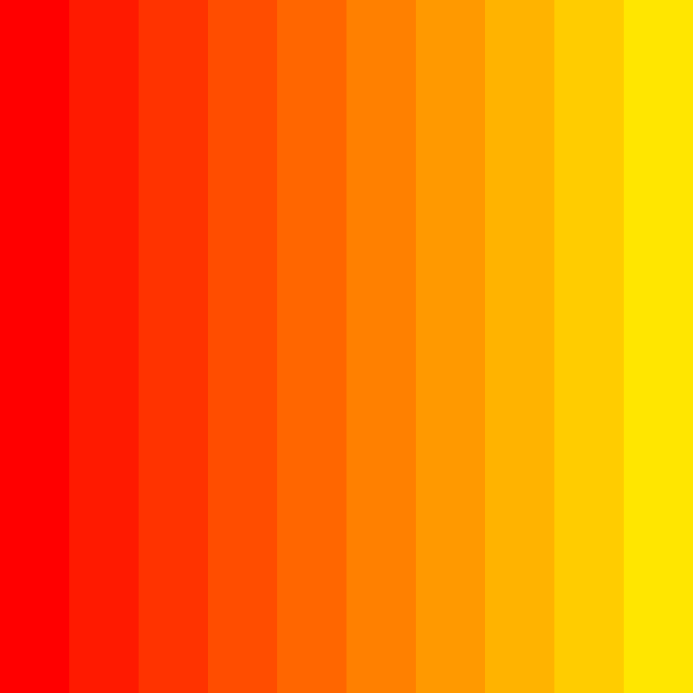
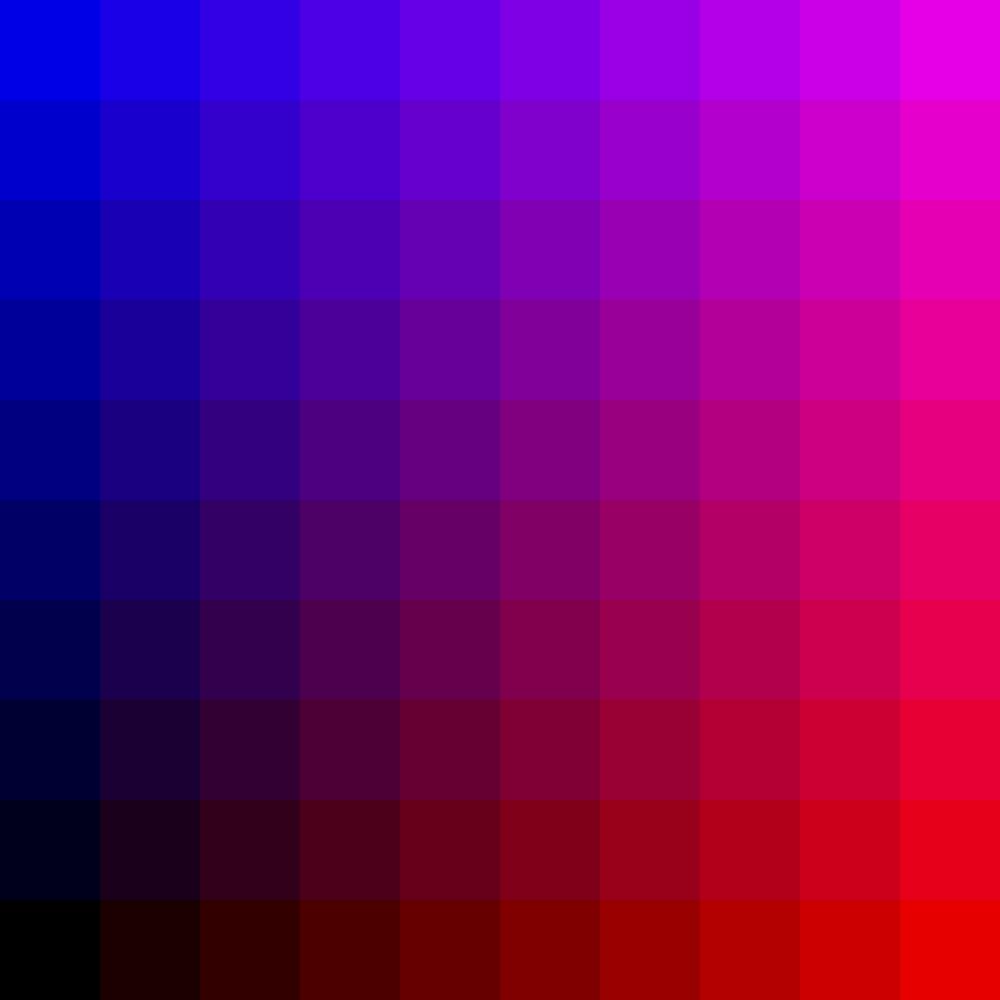
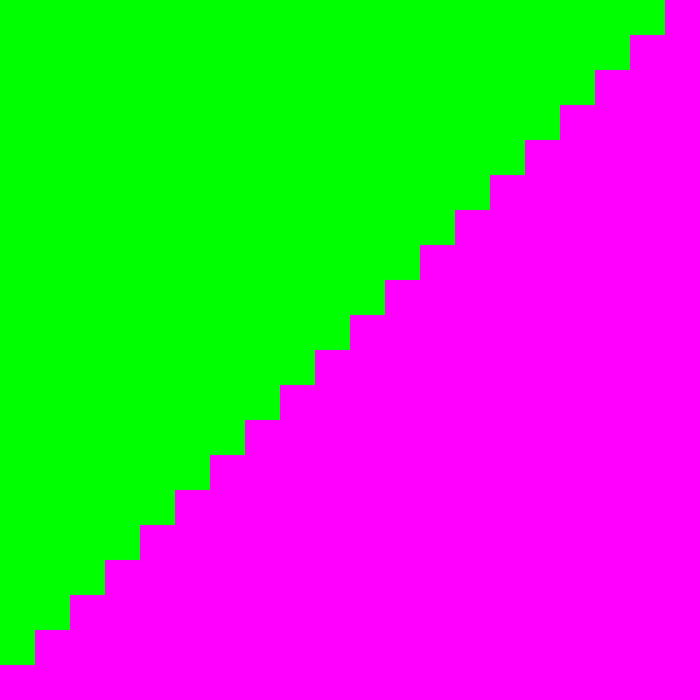
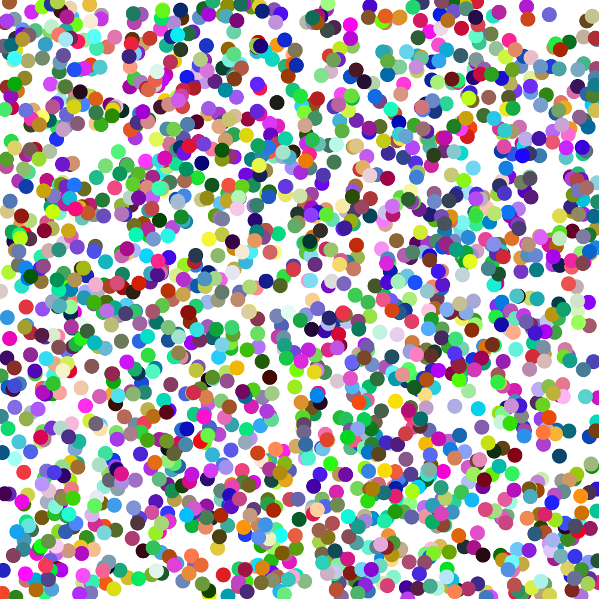

# Session 1 Challenges

Here are some challenges building on the things we started this week!

## Donut

Use `oval()`s to draw a donut that fills the canvas. Bonus points if you make the donut responsive to the canvas size. 🍩

## Stripes

Create a series of rectangles that act as a gradient by augmenting the red, green, or blue fill values rather than setting them randomly. You can do it by drawing each rectangle, or as a loop! 🌇

## Gridient

Create a grid of squares that form a gradient starting from one color in the upper left square and finishing as a second color in the lower right square.

## Staircase

Augment rectangle heights to draw a staircase. Again, you can do it as individual steps or put `rect()` inside a loop! 🪜

## Confetti

Use `random()` along with `width()` and `height()` to draw shapes at random positions on the canvas 🎉

## Composition notebook

Recreate the cover of a classic US student composition notebook with text() and randomly-drawn black circles.

