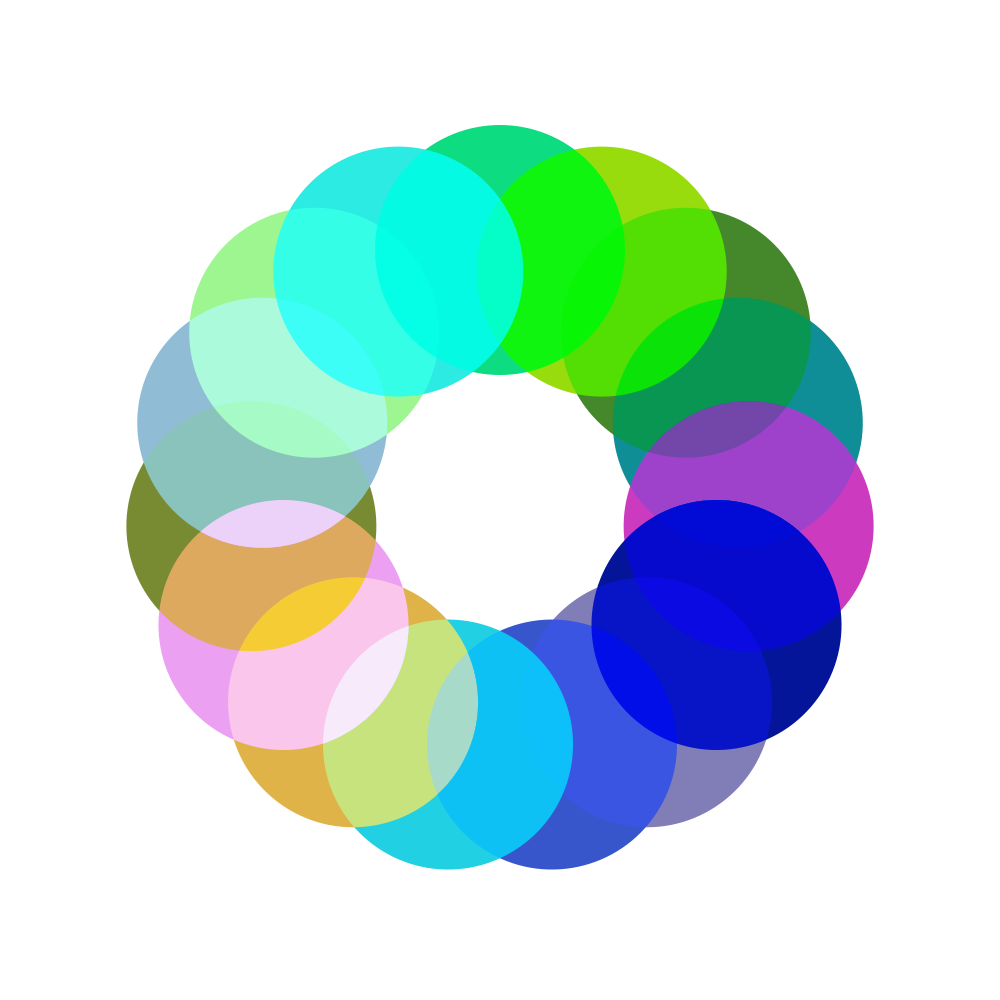
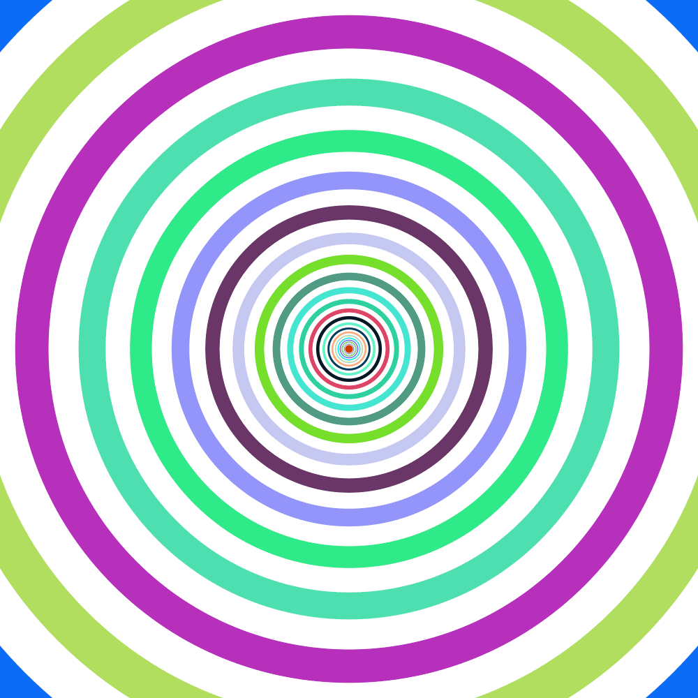
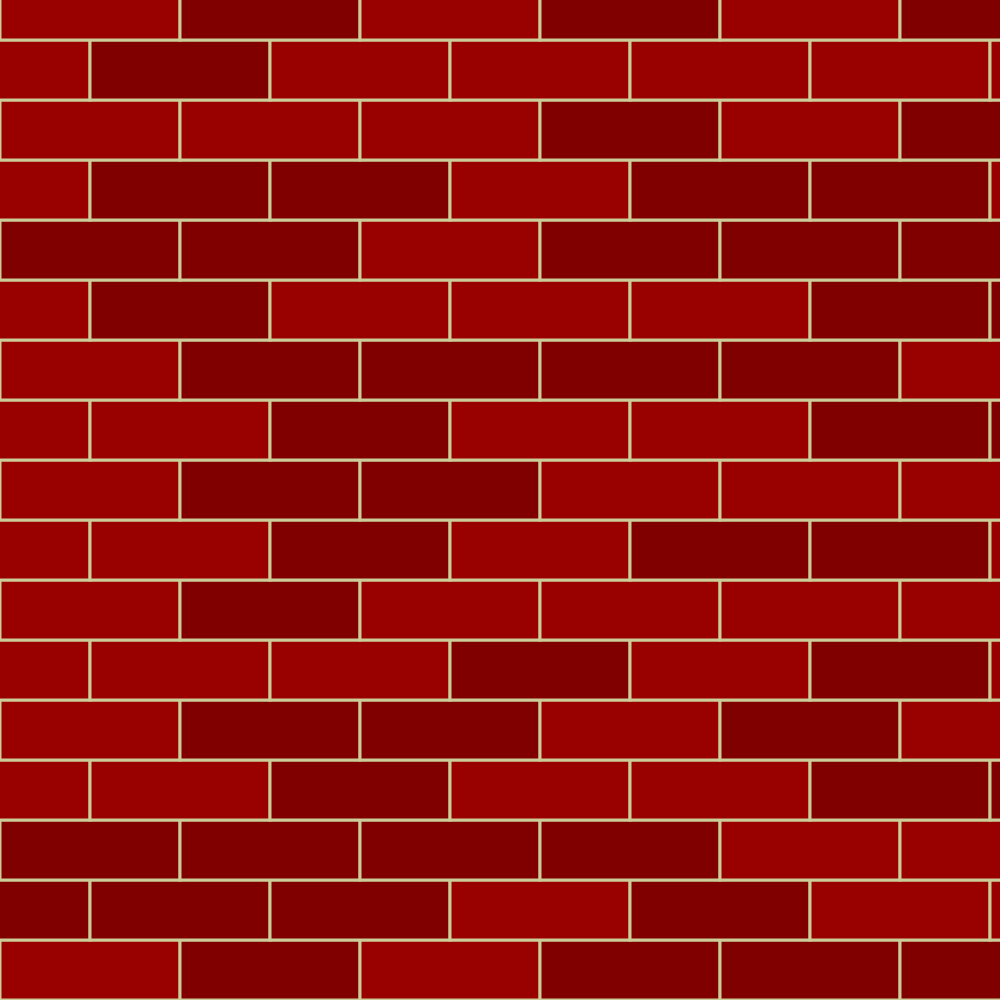

# Session 2 Challenges

## Circle of Circles

Draw a ring of circles in the center of the canvas using `translate()` and `rotate()` (tip: my example uses random colors and `blendMode('overlay')` to make the overlaps visible)

## Concentric Shapes

Draw concentric circles that alternate between a random color and white

## Bricks

Draw a brick wall.

